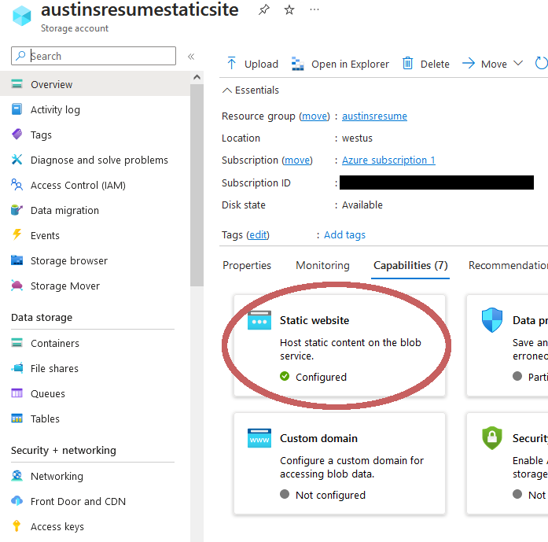
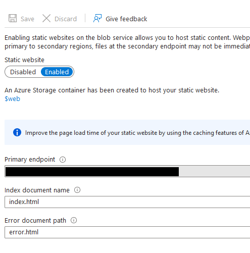
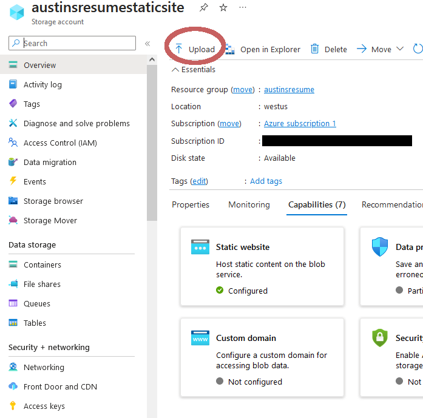
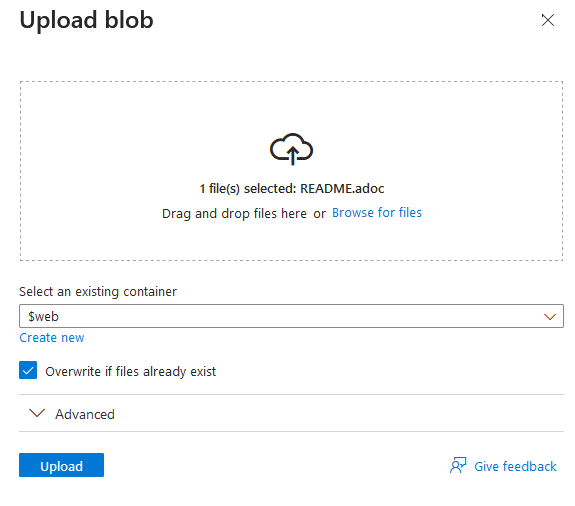

= Azure Resume

== Frontend
Created some simple html and css for the visuals. The _script.js_ file is
sending a request to an Azure function and that Azure Function returns the
number of users that have accessed the webpage from cosmosdb.

[source, javascript]
----
// get counter paragraph element from dom
const doc_visitor_count = document.querySelector("#counter p");

// send a post request to Azure Function
fetch("https://austinsresumefunction.azurewebsites.net/api/httpexample", {
    method: "POST",
    headers: {
        "Accept": "application/json",
    }
}).then(
    // Get response and parse JSON data
    res => res.json()
).then(data => {
    // change html element's content to the `count` property of the response
    // data
    doc_visitor_count.innerHTML = data.count.toString()
})
----

=== Azure Portal

==== Uploading static website to Azure

1. Created a general purpose V2 storage account with hot access tier data. Hot
   access tier is chosen because the web content will need to be accessed
   frequently.

2. clicked _capabilities_ under the storage resource overview, and then _Static_
    _website_

[start=3]
3. Enabled the static website switch, and set my index document name and error
   documnet name.

[start=4]
3. Uploaded front end files to Azure from the static websites stroage resource
   settings and made sure the content was uploaded to the `$web` container

== Backend

=== Azure Portal

1. created and Azure _Function App_ resource and a _Azure Cosmos DB for NoSQL_
   resource that's Capacity mode is serverless.

2. Made sure That Azure Fuction apps _local.setting.json_ file in the Azure
   portal contained a connection string for the static websites storage account
   and the cosmos DB storage account.

3. Changed the cors in my Azure function app to allow my primary enpoint to my
   static site and my custom domain name

=== HttpResponseMessage

The Backend is just an Azure Function that uses Azure Cosmos DB output bindings
following the In-process model. The asynchronous function `HttpResponseMessage`
has some important parameters

==== `req` HttpResponseMessage parameter

[source, cs]
----
[HttpTrigger(AuthorizationLevel.Anonymous, "get", "post", Route = null)] HttpRequest req,
----

This parameter is used to respond to  a "get", or "post" requests. It uses
anonymous authorization level meaning that no API key is required to invoke the
function. `req` well contain

==== `counter` HttpResponseMessage parameter

[source, cs]
----
[CosmosDB(databaseName: "my-database", collectionName: "my-container", Id = "1",
                        PartitionKey = "1", 
                        ConnectionStringSetting = "CosmosDbConnectionString")]
                        Counter counter,
----

This parameter connected to cosmos DB using the database that has the name
"my-database", collection named "my-container", Id of 1, PartitionKey of 1, and
the connection string from the CosmosDbConnectionString property in
_local.settings.json_. It will contain the output of this query in `counter`;

==== `updateCounter` HttpResponseMessage parameter

[source, cs]
----
[CosmosDB(databaseName: "my-database", collectionName: "my-container",
 Id = "1", PartitionKey = "1",
 ConnectionStringSetting = "CosmosDbConnectionString"
 )] out Counter updatedCounter,
----

This parameter also connects to cosmos DB using the specific values from the
attribute but it is used to send data back to the database.

==== Body

The function bodies steps:

1. Takes the `updateCounter` and sets it to `counter`
2. Increments `updateCounter.Count` by one
3. Serializes counter as a JSON string
4. Returns the JSON string to update the cosmos DB

== CI/CD

== Github actions

Followed these articals to implement github actions for front and back end and
change workflows to work with my project.

- https://learn.microsoft.com/en-us/azure/azure-functions/functions-how-to-github-actions?tabs=windows%2Cdotnet&pivots=method-manual[microsft github actions backend]
- https://learn.microsoft.com/en-us/azure/storage/blobs/storage-blobs-static-site-github-actions?tabs=userlevel[static site github action]

== DNS

=== Setting up Custom Domain

1. Bought a domain name for my website

2. made CNAME record in the DNS management to map primary
   endpoint

3. Created a URL redirect to my custom domain

=== Azure portal

1. From my static websites storage resource settings I created an Azure CDN with
   the origin host name as my static website's primary endponrt

2. Set up the Custom Domain in the azure CDN to my custom domain
